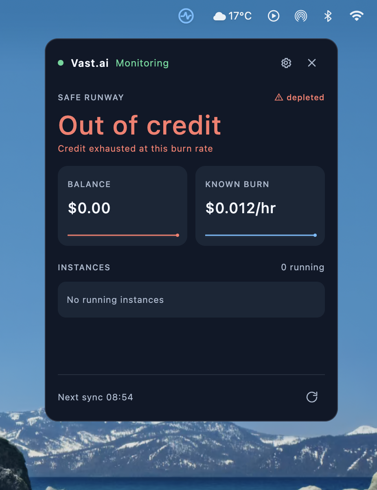

# CreditWatch

CreditWatch is a local-first desktop utility for monitoring prepaid cloud credits. It aims to show your balance, known burn rate, estimated runway, and obvious signs of underused resources in a compact dashboard. Vast.ai is the first provider.

**Status:** Private development. The app can connect with a Vast.ai key, refresh automatically every 60 seconds, and show balance, known burn, and runway from known costs. On macOS it uses Keychain, on Windows Credential Manager, and on Linux Secret Service through `secret-tool`. Linux needs `secret-tool` and an unlocked desktop keyring; connection is blocked if secure storage is unavailable. Samples are stored locally in SQLite for 72 hours. The one-hour burn average feeds safe runway when enough recent samples exist. The dashboard and compact menu bar view show one-hour trends and running instance IDs with known compute rates. Provider and action search opens below the dashboard search field. Fresh low-runway readings trigger 12h, 6h, and 1h alerts with persisted deduplication and tray notifications; each threshold can be switched off, and one the runway has already fallen under cannot be armed, because it would fire at once instead of warning early. Alerts can also be published to a phone through an ntfy topic paired by QR code — while CreditWatch is running, since a sleeping computer measures nothing and therefore sends nothing. Provider and monitoring tests use fake data. Real-account and cross-platform verification, burn-spike alerts, and configurable tiles remain.

## What it looks like



The popover is the whole application — there is no main window. It opens under the menu bar
icon and closes when it loses focus. The screenshot above is a real account that has reached
zero, which is the state most worth showing, and every part of it is readable:

- **Header.** A status dot, the provider name, and the sync state in one line. Green means a
  fresh reading; amber covers saved data, rate limiting, partial data, and being offline. The
  gear opens settings in place, the cross closes the popover.
- **Headline.** The safe runway, which includes a 10% buffer over the higher of the current
  burn and the one-hour average. It is coloured by health rather than being decorative: green
  while there is room, amber once a threshold trips, red in the last hour, and red reading
  "Out of credit" when the balance is gone. `0m` is not used for a depleted account, because a
  countdown at zero still looks like a countdown.
- **Depleted marker.** The triangle and the word to the right of `SAFE RUNWAY` repeat the state
  in a second channel for anyone who cannot rely on the colour.
- **Subline.** Why the safe figure differs from the raw one — the buffer, a missing price, a
  stale reading, or, here, that the credit is exhausted at this burn rate.
- **Balance and known burn.** Two tiles with area-filled sparklines over a six-hour window.
  The balance tile turns red with the headline. The fill covers measured readings only: a
  projection to zero is drawn as an unfilled dashed line, and a gap in the readings breaks the
  fill rather than inventing a shape across it. A series that never moves is held at mid-height
  so it reads as steady instead of as absent.
- **Instances.** Running instances only, each with the chip icon, its id, its label, and its
  known hourly compute rate. "0 running" here is consistent with the burn having collapsed to
  storage and bandwidth once the credit ran out.
- **Footer.** The time of the next automatic sync, and a manual refresh that is disabled during
  a failure backoff so it cannot be used to hammer a rate-limited provider.

## Principles

- Credentials stay on the user's computer in operating-system secure storage.
- Cloud access is read-only; V1 does not create, stop, or delete resources.
- Distinguish provider-reported values from measured and estimated values.
- Keep provider-specific formats out of the calculation engine.
- Telemetry is optional. Billing and runway remain useful without an agent.
- The dashboard has at most twelve equal-sized tiles.
- No CreditWatch account, central backend, or mandatory analytics.

## Technology

Kotlin/JVM and Java 21, Gradle, Compose Multiplatform Desktop, Ktor Client, Kotlin coroutines, and SQLite/JDBC. Java source can live beside Kotlin source in each module under `src/main/java`. Dependencies for later milestones will be added when their implementation begins.

## Get started

Install JDK 21, then from the repository root:

```sh
./gradlew test
./gradlew :app-desktop:run
```

On macOS, look for the CreditWatch pulse icon near the right end of the menu bar. Click it for a compact view positioned beneath the icon; its menu opens the full dashboard, refreshes data, or quits the app. Search providers and actions with **⌘K**, the quick view's Search button, or the dashboard search field. Results appear below that field. Use the small theme switch in the dashboard or quick view to toggle Light/Dark; the choice is saved locally. The tray menu also cycles System, Dark, and Light. The provider connection screen links to [Vast's API key guide](https://docs.vast.ai/guides/reference/keys). On Windows and Linux, where a system tray is available, the same tray workflow is used. If no tray is available, the full dashboard opens directly.

The desktop app uses Kotlin/JVM and Compose Desktop on JDK 21. Its shared application code targets macOS, Windows, and Linux, while secure key storage uses the native service on each OS. Windows uses Credential Manager. Linux requires a running Secret Service and the `secret-tool` executable from libsecret tools; the app blocks connection and explains the problem when storage is unavailable. The full suite and desktop compilation pass on macOS and in an ARM64 Linux JDK 21 container. A live Linux Secret Service save/read/delete smoke test also passes in a headless container. The Windows Credential Manager smoke test is wired into CI. [Windows ARM64 and x64 runtime verification](https://github.com/Astralchemist/creditwatch/issues/9) and installers remain open; the cross-platform CI run is currently blocked by [GitHub Actions billing](https://github.com/Astralchemist/creditwatch/issues/4).

On this Mac, Homebrew installed JDK 21 at `/opt/homebrew/opt/openjdk@21/libexec/openjdk.jdk/Contents/Home`. If your shell still selects another JDK, set `JAVA_HOME` to that path before running the commands. Open the root directory as a Gradle project in IntelliJ IDEA and select JDK 21 as the Gradle JVM. The build requests a JDK 21 toolchain.

## Delivery and tracking

CreditWatch is a Kotlin/JVM desktop application. It reads Vast.ai through the provider API using a locally stored key. Users will install a native desktop package when packaging is ready; npm and Bun packages are not part of the product.

The planned app version is set once in `gradle.properties`. [Roadmap](ROADMAP.md) tracks release gates, [changelog](CHANGELOG.md) records shipped changes, and [development flow](CONTRIBUTING.md) defines issue, pull request, and release checks. GitHub Actions is configured to test and compile on macOS, Windows, and Linux for pull requests and changes to `main`. There is no automatic deployment or installer publication yet.

## Modules

| Module | Responsibility |
| --- | --- |
| `core-domain` | Provider-neutral values and snapshots |
| `provider-api` | Read-only provider contract |
| `provider-vast` | Vast.ai client and mapping |
| `core-engine` | Burn, runway, alert, and efficiency calculations |
| `persistence` | SQLite schema, migrations, repositories |
| `notifications` | Desktop notifications and deduplication |
| `telemetry-api` | Optional telemetry contract |
| `telemetry-agent` | Independently runnable Linux agent, later |
| `app-desktop` | Compose UI and application wiring |
| `test-fixtures` | Provider response fixtures |

The app is the composition root. The core modules must not depend on Compose, HTTP, SQLite, or Vast.ai. Provider DTOs stay inside `provider-vast`.

## Build order

1. **Skeleton:** launchable desktop window, modules, test setup.
2. **Vast connection:** minimum-permission API key, OS secret store, validation, account and instance reads.
3. **First useful view:** balance, known burn, raw runway, and safe runway with clear data quality labels.
4. **Monitoring:** polling, bounded history, stale/offline state, backoff.
5. **Alerts:** low-runway rules, hysteresis, persisted deduplication, tray notifications, per-threshold switches, and phone delivery over ntfy are in place; burn-spike and efficiency alerts remain.
6. **Dashboard and tray:** compact tray view and search are in place; twelve configurable tiles remain.
7. **Optional telemetry:** Linux agent and transparent efficiency hints.
8. **Packaging:** native artifacts and release checks.

The first vertical slice is API key → Vast account and instances → known burn → planning runway → three cards. The adapter currently uses the [Vast OpenAPI specification](https://github.com/vast-ai/docs/blob/main/api-reference/openapi.yaml) for `/api/v0/users/current` and paginated `/api/v1/instances`. Missing compute or storage prices make runway unavailable; bandwidth is displayed as excluded.

## Cost accuracy

Balances use decimal money, not floating point. Rates normalize to hourly values. Unknown bandwidth cost stays unknown; a known partial burn is never shown as an exact total. A stopped Vast instance may still incur storage charges. Safe runway uses the greater of current burn and the available one-hour moving average, multiplied by a safety factor of 1.10. History gaps do not count as zero burn. The factor is fixed for now; it will become configurable in settings. Runway excludes unprojected bandwidth and is an estimate, not a guarantee.

## Original specification

The full product specification was supplied in the project discussion. This README captures the product boundary and starting architecture; detailed alert thresholds, telemetry transport, persistence schema, acceptance cases, and release criteria will be implemented in their respective milestones.

