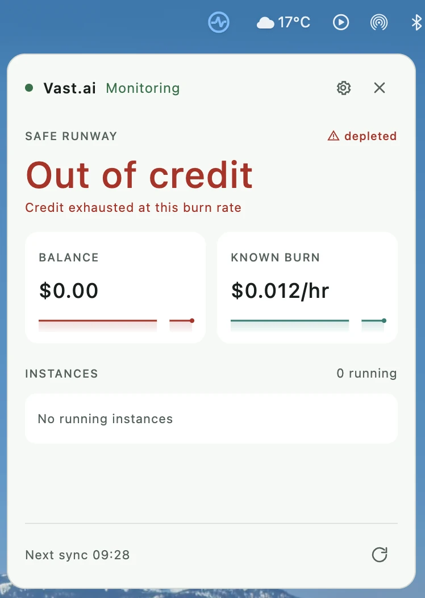
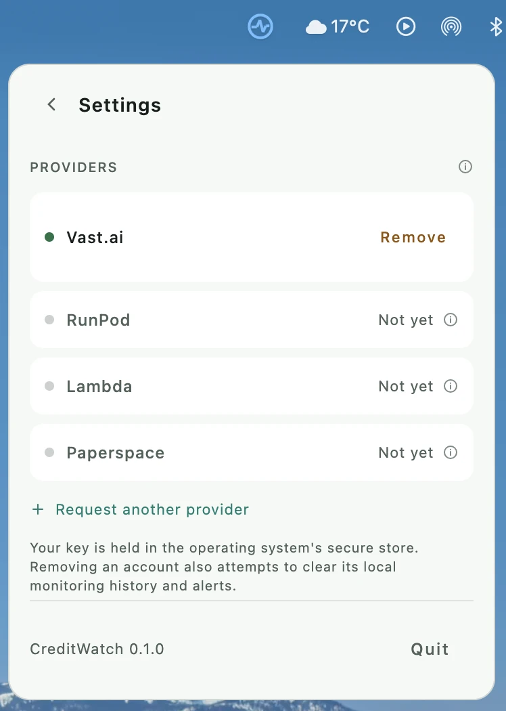
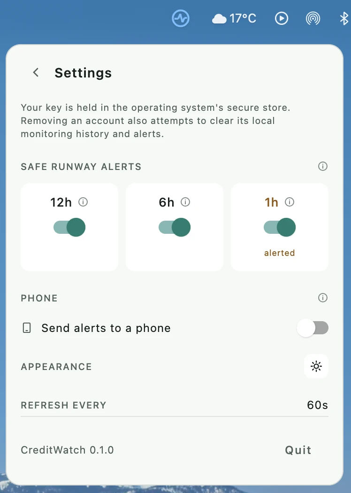

# CreditWatch

CreditWatch is a local-first desktop utility for monitoring prepaid cloud credits. It shows your balance, known burn rate, estimated runway, and obvious signs of underused resources in a compact menu bar popover. Vast.ai is the first provider.

**Status:** Private development, no release yet. 0.1.0 is scoped to **one Vast.ai account on macOS**. The app connects with a Vast.ai key held in Keychain, refreshes every 60 seconds with backoff and stale marking, and shows balance, known burn and runway from known costs. Samples are kept locally in SQLite for 72 hours, and the one-hour burn average feeds safe runway once enough recent samples exist. The menu bar popover is the whole interface — there is no dashboard window. Fresh low-runway readings trigger 12h, 6h and 1h alerts with persisted deduplication and native notifications; each threshold can be switched off, and one the runway has already fallen under cannot be armed, because it would fire at once instead of warning early. Alerts can also be published to a phone through an ntfy topic paired by QR code, while CreditWatch is running — a sleeping computer measures nothing and so sends nothing. Windows and Linux credential stores are implemented and unit tested but unverified at runtime, so they are 0.2.0. Stopped-instance behaviour, macOS CI, burn-spike alerts and multi-provider monitoring remain.

## What it looks like



The popover is the whole application — there is no main window. It opens under the menu bar
icon and closes when it loses focus. The account above is a real one that has reached zero,
which is the state most worth showing, and every part of it is readable:

- **Header.** A status dot, the provider name, and the sync state in one line. Green means a
  fresh reading; amber covers saved data, rate limiting, partial data, and being offline. The
  gear opens settings in place, the cross closes the popover.
- **Headline.** The safe runway, which includes a 10% buffer over the higher of the current
  burn and the one-hour average. It is coloured by health rather than decoratively: green while
  there is room, amber once a threshold trips, red in the last hour, and red reading "Out of
  credit" when the balance is gone. `0m` is not used for a depleted account, because a
  countdown at zero still looks like a countdown.
- **Depleted marker.** The triangle and the word beside `SAFE RUNWAY` repeat the state in a
  second channel for anyone who cannot rely on the colour.
- **Subline.** Why the safe figure differs from the raw one — the buffer, a missing price, a
  stale reading, or, here, that the credit is exhausted at this burn rate.
- **Balance and known burn.** Two tiles with area-filled sparklines over a six-hour window.
  The balance tile turns red with the headline. The fill covers measured readings only: a
  projection to zero is drawn as an unfilled dashed line, and a gap in the readings breaks the
  fill rather than inventing a shape across it. A series that never moves is held at mid-height
  so it reads as steady rather than as absent.
- **Instances.** Running instances only, each with the chip icon, its id, its label, and its
  known hourly compute rate. "0 running" here is consistent with the burn having collapsed to
  storage and bandwidth once the credit ran out.
- **Footer.** The time of the next automatic sync, and a manual refresh that is disabled during
  a failure backoff so it cannot be used to hammer a rate-limited provider.

### Settings



Settings slides in over the popover rather than opening a window. Providers are rows, so a
second account is an obvious next step rather than a redesign. Only Vast.ai has an adapter
today and only it can be connected; the rest are listed and visibly unavailable, because a user
who came for RunPod should learn that here rather than by hunting for it. Each unavailable row
carries a hover hint explaining what is missing. Monitoring still runs a single account — the
roadmap names the four things a second one needs.



- **Safe runway alerts.** The three thresholds sit side by side as switches. The heading carries
  the words "safe runway" once, so each cell is a duration and a hover hint rather than the same
  phrase three times. A cell marks itself `alerted` when that threshold is the one currently
  tripped, and `held` when it cannot be armed — a threshold the runway has already fallen under
  is refused, because switching it on would fire at once instead of warning early. A threshold
  armed *before* the fall still fires; the reading governs arming only.
- **Phone.** Publishes the same alerts to an ntfy topic that a phone subscribes to by scanning a
  QR code. Switching it on generates a private topic and shows the code. The section says
  plainly that this works only while CreditWatch is running: a sleeping computer measures
  nothing and therefore sends nothing.
- **Appearance.** One icon, not three labelled buttons — a sun, a moon, or a half dial for
  System. It shows the current mode and cycles on click, with the names in the hover hint.

## Principles

- Credentials stay on the user's computer in operating-system secure storage.
- Cloud access is read-only; V1 does not create, stop, or delete resources.
- Distinguish provider-reported values from measured and estimated values.
- Keep provider-specific formats out of the calculation engine.
- Telemetry is optional. Billing and runway remain useful without an agent.
- The dashboard has at most twelve equal-sized tiles.
- No CreditWatch account, central backend, or mandatory analytics.

## Technology

Kotlin/JVM and Java 21, Gradle, Compose Multiplatform Desktop, Ktor Client, Kotlin coroutines, and SQLite/JDBC. Java source can live beside Kotlin source in each module under `src/main/java`. Dependencies for later milestones will be added when their implementation begins.

## Get started

Install JDK 21, then from the repository root:

```sh
./gradlew test
./gradlew :app-desktop:run
```

Look for the CreditWatch pulse icon near the right end of the menu bar. Click it for the popover, positioned beneath the icon; the tray menu shows it, refreshes, opens settings, cycles the theme, or quits. Settings slides in over the popover rather than opening a window: providers, the runway alert switches, phone pairing, and appearance as a single icon that cycles System, Dark and Light. The provider connection screen links to [Vast's API key guide](https://docs.vast.ai/guides/reference/keys). Where no system tray is available the popover opens directly as a plain window, and closing it quits.

The desktop app uses Kotlin/JVM and Compose Desktop on JDK 21. The application code targets macOS, Windows and Linux, and secure key storage uses the native service on each: Keychain, Credential Manager, or Secret Service through the `secret-tool` executable from libsecret tools, which Linux also needs an unlocked keyring for. Connection is blocked, with an explanation, when secure storage is unavailable.

**0.1.0 claims macOS only.** The suite and desktop compilation pass on macOS and in an ARM64 Linux JDK 21 container, and a live Secret Service save/read/delete smoke test passes headless, but passing in a container is not the same as someone running the desktop app. [Windows runtime verification](https://github.com/Astralchemist/creditwatch/issues/9), Windows and Linux notifications, and `.msi`/`.deb` packaging are deferred to 0.2.0 rather than dropped — the code stays cross-platform, only the promise is narrowed. The CI run that would cover all three is blocked by [GitHub Actions billing](https://github.com/Astralchemist/creditwatch/issues/4).

On this Mac, Homebrew installed JDK 21 at `/opt/homebrew/opt/openjdk@21/libexec/openjdk.jdk/Contents/Home`. If your shell still selects another JDK, set `JAVA_HOME` to that path before running the commands. Open the root directory as a Gradle project in IntelliJ IDEA and select JDK 21 as the Gradle JVM. The build requests a JDK 21 toolchain.

**Packaging needs a different JDK.** `test` and `run` are happy with Homebrew's build, but Compose refuses to run `packageDmg` against it, because jpackage produces broken bundles from that distribution ([compose-multiplatform#3107](https://github.com/JetBrains/compose-multiplatform/issues/3107)). Point `JAVA_HOME` at any non-Homebrew JDK 21 — Microsoft, Temurin and Corretto builds all work — before running:

```sh
JAVA_HOME=/path/to/non-homebrew-jdk-21 ./gradlew :app-desktop:packageDmg
```

The result lands in `app-desktop/build/compose/binaries/main/dmg/`. Setting `compose.desktop.packaging.checkJdkVendor=false` silences the refusal but not the underlying problem, so it is not the way round this.

## Delivery and tracking

CreditWatch is a Kotlin/JVM desktop application. It reads Vast.ai through the provider API using a locally stored key. The macOS `.dmg` builds and installs; Windows `.msi` and Linux `.deb` are configured but untested. npm and Bun packages are not part of the product.

**0.1.0 monitors one provider account.** The settings pane lists other providers and marks them unavailable, because only Vast.ai has an adapter. The storage schema and the burn engine are already keyed by account, but the session and the popover hold one of everything, so a second account is a 0.2.0 change rather than a configuration away.

The planned app version is set once in `gradle.properties`. [Roadmap](ROADMAP.md) tracks release gates, [changelog](CHANGELOG.md) records shipped changes, and [development flow](CONTRIBUTING.md) defines issue, pull request, and release checks. GitHub Actions is configured to test and compile on macOS, Windows, and Linux for pull requests and changes to `main`. There is no automatic deployment or installer publication yet.

## Modules

| Module | Responsibility |
| --- | --- |
| `core-domain` | Provider-neutral values and snapshots |
| `provider-api` | Read-only provider contract |
| `provider-vast` | Vast.ai client and mapping |
| `core-engine` | Burn, runway, alert, and efficiency calculations |
| `persistence` | SQLite schema, migrations, repositories |
| `notifications` | Desktop notifications and deduplication |
| `telemetry-api` | Optional telemetry contract |
| `telemetry-agent` | Independently runnable Linux agent, later |
| `app-desktop` | Compose UI and application wiring |
| `test-fixtures` | Provider response fixtures |

The app is the composition root. The core modules must not depend on Compose, HTTP, SQLite, or Vast.ai. Provider DTOs stay inside `provider-vast`.

## Build order

1. **Skeleton:** launchable desktop window, modules, test setup.
2. **Vast connection:** minimum-permission API key, OS secret store, validation, account and instance reads.
3. **First useful view:** balance, known burn, raw runway, and safe runway with clear data quality labels.
4. **Monitoring:** polling, bounded history, stale/offline state, backoff.
5. **Alerts:** low-runway rules, hysteresis, persisted deduplication, tray notifications, per-threshold switches, and phone delivery over ntfy are in place; burn-spike and efficiency alerts remain.
6. **Dashboard and tray:** compact tray view and search are in place; twelve configurable tiles remain.
7. **Optional telemetry:** Linux agent and transparent efficiency hints.
8. **Packaging:** native artifacts and release checks.

The first vertical slice is API key → Vast account and instances → known burn → planning runway → three cards. The adapter currently uses the [Vast OpenAPI specification](https://github.com/vast-ai/docs/blob/main/api-reference/openapi.yaml) for `/api/v0/users/current` and paginated `/api/v1/instances`. Missing compute or storage prices make runway unavailable; bandwidth is displayed as excluded.

## Cost accuracy

Balances use decimal money, not floating point. Rates normalize to hourly values. Unknown bandwidth cost stays unknown; a known partial burn is never shown as an exact total. A stopped Vast instance may still incur storage charges. Safe runway uses the greater of current burn and the available one-hour moving average, multiplied by a safety factor of 1.10. History gaps do not count as zero burn. The factor is fixed for now; it will become configurable in settings. Runway excludes unprojected bandwidth and is an estimate, not a guarantee.

## Original specification

The full product specification was supplied in the project discussion. This README captures the product boundary and starting architecture; detailed alert thresholds, telemetry transport, persistence schema, acceptance cases, and release criteria will be implemented in their respective milestones.

